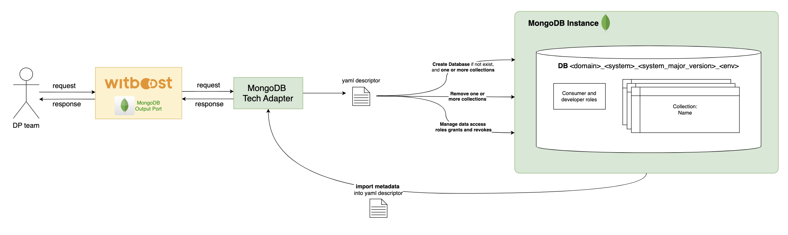

<p align="center">
    <a href="https://www.witboost.com/">
        
    </a>
</p>

Designed by [Agile Lab](https://www.agilelab.it/), Witboost is a versatile platform that addresses a wide range of sophisticated data engineering challenges. It enables businesses to discover, enhance, and productize their data, fostering the creation of automated data platforms that adhere to the highest standards of data governance. Want to know more about Witboost? Check it out [here](https://www.witboost.com/) or [contact us!](https://witboost.com/contact-us)

This repository is part of our [Starter Kit](https://github.com/agile-lab-dev/witboost-starter-kit) meant to showcase Witboost integration capabilities and provide a "batteries-included" product.

# MongoDB Tech Adapter

- [Overview](#overview)
- [HLD](docs/HLD.md)
- [Building](#building)
- [Running](#running)
- [OpenTelemetry Setup](tech-adapter/docs/opentelemetry.md)
- [Deploying](#deploying)
- [API specification](docs/API.md)

## Overview

This project implements a Tech Adapter for MongoDB implemented using Python & FastAPI.
The MongoDB Tech Adapter acts as a middleware between the **Witboost MongoDB Output Port** and the **MongoDB instance**. Once this microservice is deployed and configured within Witboost, the platform can deploy components that interact with MongoDB.



### Supported Operations

**Database Creation**:
if the specified database does not already exist in the MongoDB instance, the Tech Adapter creates it. The database follows a naming convention:
`<domain>_<system>_<system_major_version>_<env>`

**Collection Management**:
one or more collections can be created within the database. The adapter also supports removal of existing collections as defined in the YAML descriptor.

**Role and Permission Management**:
creates or updates MongoDB roles, typically for **consumer** and **developer** access levels. These roles are assigned appropriate permissions for the collections.

**Metadata Import**:
import metadata from the MongoDB instance back into the YAML descriptor. This helps synchronize the descriptor with the current state of the database.


### Access Control

Role management is currently limited to the **Data Product Owner**.

- `database_developer`: full read/write access (similar to MongoDB `dbOwner`)
- `database_collection_consumer`: custom read-only role (only `find` action allowed)

> ℹ️ Role names include the actual `database` and `collection` names.

> 🔗 See [MongoDB Authorization Docs](https://www.mongodb.com/docs/manual/core/authorization/) for more details.

### What's a Tech Adapter?

A Tech Adapter is a microservice which is in charge of deploying components that use a specific technology. When the deployment of a Data Product is triggered, the platform generates it descriptor and orchestrates the deployment of every component contained in the Data Product. For every such component the platform knows which Tech Adapter is responsible for its deployment, and can thus send a provisioning request with the descriptor to it so that the Tech Adapter can perform whatever operation is required to fulfill this request and report back the outcome to the platform.

You can learn more about how the Tech Adapters fit in the broader picture [here](https://docs.witboost.agilelab.it/docs/p2_arch/p1_intro/#deploy-flow).

### MongoDB

MongoDB is a general-purpose, document-oriented NoSQL database designed for high performance, high availability, and easy scalability. It stores data in flexible, JSON-like documents, meaning fields can vary from document to document and data structure can be changed over time.

MongoDB combines the power of traditional relational databases with the flexibility of modern NoSQL architectures. It is designed to handle large volumes of structured and unstructured data, making it ideal for a wide range of applications — from real-time analytics to content management and IoT.

For example, MongoDB supports powerful indexing and querying capabilities, dynamic schemas, and horizontal scalability through sharding. Its architecture also enables high availability through replica sets and built-in fault tolerance.

MongoDB provides the foundation for building modern, cloud-native applications that need to process and serve massive amounts of data in real time. It is widely used across industries for its developer-friendly model and operational simplicity.

- MongoDB includes the following key capabilities:
- Flexible, document-based data model
- Powerful query language and secondary indexes
- Horizontal scalability with sharding
- High availability with replica sets
- Integrated aggregation framework for analytics
- Rich ecosystem of drivers and tools
- Cloud-native experience with MongoDB Atlas

Learn more on [MongoDB documentation](https://www.mongodb.com/docs/)

### Software stack

This microservice is written in Python 3.11, using FastAPI for the HTTP layer. Project is built with Poetry and supports packaging as Wheel and Docker image, ideal for Kubernetes deployments (which is the preferred option).

## Building

**Requirements:**

- Python ~3.11 (this is a **strict** requirement as of now, due to uvloop 0.17.0)
- Poetry

If you don't have any instance of Python 3 installed, you can install Python 3.11 directly executing the following commands:

```shell
sudo apt update
sudo apt install software-properties-common
sudo add-apt-repository ppa:deadsnakes/ppa
sudo apt update
sudo apt install python3.11
python3.11 --version
which python3.11
```

If you do have Python 3 installed, but not version 3.11 required by this project, we recommend using _pyenv_ to manage python environments with different versions, as it is flexible and fully compatible with Poetry. You can install _pyenv_ following the guide [here](https://github.com/pyenv/pyenv?tab=readme-ov-file#installation). Then, to install and configure to use Python 3.11 on the project simply execute:

```shell
pyenv install 3.11
cd tech-adapter
pyenv local 3.11
```

**Installing**:

To set up a Python environment we use [Poetry](https://python-poetry.org/docs/):

```
curl -sSL https://install.python-poetry.org | python3 -
```

Once Poetry is installed and in your `$PATH`, you can execute the following:

```
poetry --version
```

If you see something like `Poetry (version x.x.x)`, your installation is ready to use!

Install the dependencies defined in `tech-adapter/pyproject.toml`:

```shell
cd tech-adapter
poetry env use 3.11
poetry install
```

Note: All the following commands are to be run in the Poetry project directory with the virtualenv enabled. If you use _pyenv_ to manage multiple Python runtimes, make sure Poetry is using the right version. You can tell _pyenv_ to use the Python version available in the current shell. Check this Poetry docs page [here](https://python-poetry.org/docs/managing-environments/).

**Type check:** is handled by mypy:

```bash
poetry run mypy src/
```

**Tests:** are handled by pytest:

```bash
poetry run pytest --cov=src/ tests/. --cov-report=xml
```

**Artifacts & Docker image:** the project leverages Poetry for packaging. Build package with:

```
poetry build
```

The Docker image can be built with:

```
docker build .
```

More details can be found [here](tech-adapter/docs/docker.md).

_Note:_ the version for the project is automatically computed using information gathered from Git, using branch name and tags. Unless you are on a release branch `1.2.x` or a tag `v1.2.3` it will end up being `0.0.0`. You can follow this branch/tag convention or update the version computation to match your preferred strategy.

**CI/CD:** the pipeline is based on GitLab CI as that's what we use internally. It's configured by the `.gitlab-ci.yaml` file in the root of the repository. You can use that as a starting point for your customizations.

## Environment Setup

Before starting the project locally, you need to create a `.env` file to configure the required environment variables.

Below are the variables you need to include:

```env
# MongoDB connection string
CONNECTION_STRING=<your_connection_uri_here>

# Name of the database that stores user information
USERS_DATABASE=database_admin

# Roles considered as developers
DEVELOPER_ROLES=["dbOwner"]

# Actions allowed for consumers
CONSUMER_ACTIONS=["find"]

# Use case template ID for MongoDB output port components
USECASETEMPLATEID=urn:dmb:utm:mongodb-outputport-template:0.0.0

# Use case template ID for MongoDB output port subcomponents
USECASETEMPLATESUBID=urn:dmb:utm:mongodb-outputport-subcomponent-template:0.0.0
```

### Additional Info

- The `CONNECTION_STRING` should point to your MongoDB instance.
    - Replace <your_connection_uri_here> with your actual MongoDB connection string.

> For more details on how to configure MongoDB connections with Python, see the official documentation:
[MongoClient — PyMongo documentation](https://www.mongodb.com/docs/languages/python/pymongo-driver/current/connect/mongoclient/)


- `USERS_DATABASE`: The name of the MongoDB database that contains user documents.
  - This database must already exist in your local MongoDB instance.
  You should create the database manually, assign its name to the `USERS_DATABASE` environment variable, and add some test users to it in order to run the project correctly.

- `USECASETEMPLATEID` / `USECASETEMPLATESUBID`: Unique identifiers for MongoDB output port templates.
  - These identifiers are used to validate that provisioning requests match the expected MongoDB templates.
  - `USECASETEMPLATEID`: for the main component template
  - `USECASETEMPLATESUBID`: for the subcomponent template
  - They must match the `useCaseTemplateId` fields in the component/subcomponent descriptors of Data Products.
  - **Default values**: 
    - `urn:dmb:utm:mongodb-outputport-template:0.0.0` (component)
    - `urn:dmb:utm:mongodb-outputport-subcomponent-template:0.0.0` (subcomponent)
  - Use these default values unless you have custom templates.


## Running

To run the server locally, use:

```bash
cd tech-adapter
source $(poetry env info --path)/bin/activate # only needed if venv is not already enabled
uvicorn src.main:app --host 127.0.0.1 --port 8091
```

By default, the server binds to port 8091 on localhost. After it's up and running you can make provisioning requests to this address. You can also check the API documentation served [here](http://127.0.0.1:8091/docs).

## Deploying

This microservice is meant to be deployed to a Kubernetes cluster with the included Helm chart and the scripts that can be found in the `helm` subdirectory. You can find more details [here](helm/README.md).

## License

This project is available under the [Apache License, Version 2.0](https://opensource.org/licenses/Apache-2.0); see [LICENSE](LICENSE) for full details.

## About Witboost

[Witboost](https://witboost.com/) is a cutting-edge Data Experience platform, that streamlines complex data projects across various platforms, enabling seamless data production and consumption. This unified approach empowers you to fully utilize your data without platform-specific hurdles, fostering smoother collaboration across teams.

It seamlessly blends business-relevant information, data governance processes, and IT delivery, ensuring technically sound data projects aligned with strategic objectives. Witboost facilitates data-driven decision-making while maintaining data security, ethics, and regulatory compliance.

Moreover, Witboost maximizes data potential through automation, freeing resources for strategic initiatives. Apply your data for growth, innovation and competitive advantage.

[Contact us](https://witboost.com/contact-us) or follow us on:

- [LinkedIn](https://www.linkedin.com/showcase/witboost/)
- [YouTube](https://www.youtube.com/@witboost-platform)
