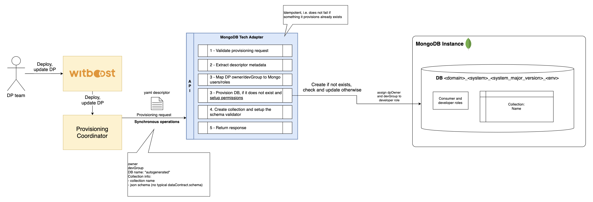
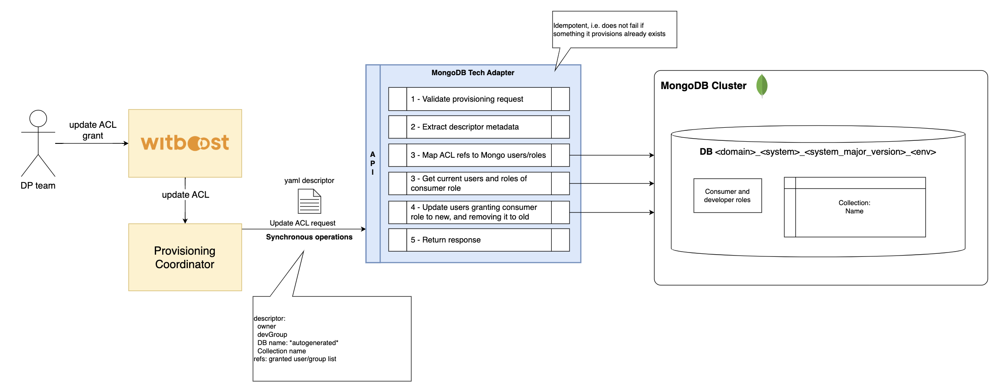

# MongoDB Tech Adapter HLD

This document describes the High Level Design of the MongoDB Tech Adapter.
The source diagrams can be found and edited in the [accompanying draw.io file](hld.drawio).

- [Overview](#overview)
- [Provisioning](#provisioning)
  - [Output Port Provisioning](#output-port-provisioning)
- [Unprovisioning](#unprovisioning)
  - [Output Port Unprovisioning](#Output-Port-Unprovisioning)
- [Update Acl](#update-acl)
- [Reverse Provisioning](#reverse-provisioning)
  - [Output Port Reverse Provisioning](#output-port-reverse-provisioning)

## Overview

### Tech Adapter

A Tech Adapter (TA) is a service in charge of performing a resource allocation task, usually through a Cloud Provider. The resources to allocate are typically referred to as the _Component_, the details of which are described in a YAML file, known as _Component Descriptor_.

The Tech Adapter is invoked by an upstream service of the Witboost platform, namely the Coordinator, which is in charge of orchestrating the creation of a complex infrastructure by coordinating several SPs in a single workflow. The Tech Adapter receives the _Data Product Descriptor_ as input with all the components (because it might need more context) plus the id of the component to provision, named _componentIdToProvision_

To enable the above orchestration a Tech Adapter exposes an API made up of five main operations:
- **validate**: checks if the provided component descriptor is valid and reports any errors.
- **provision**: allocates resources based on the previously validated descriptor - clients receive an immediate response (synchronous).
- **unprovision**: destroys the resources previously allocated.
- **updateacl**: grants access to a specific component/resource to a list of users/groups.
- **reverseprovision**: imports existing resources on Witboost to be managed by the platform lifecycle and governance.

### MongoDB Tech Adapter

This Tech Adapter is a synchronous service that interacts with a MongoDB Cluster and provisions various kinds of components based on it. The components are:

- Output Port: A list of subcomponents representing a MongoDB collection each, all stored on a common Database.

It also takes care of setting up resources on MongoDB such as the *Database* in which the other components live, and *Roles* to manage the Database and collections and consume data.

## Roles and Permissions - Access control structure

In MongoDB, each user is created within a specific Database, which serves as the user's authentication Database. The user's permissions are determined by the Roles, allowing administrators to control access based on specific operational needs.
Roles are entirely configurable by the user, enabling customized configurations for different environments.

Databases follow a specific naming pattern to ensure consistency and traceability across environments: `<domain>_<system>_<system_major_version>_<env>`.
Instead, collection names are user-defined and fully configurable during the creation of the Data Product.

The access control logic can follow this approach:

**Provision**: The system owner and the development group are granted the dbOwner role, which provides full read and write access to the Database. At this stage, roles follow a naming convention that specifies only the Database: `<db_name>_developer`.

**Update ACL**: User roles can be updated to reflect new access requirements. For example, elevated privileges can be revoked and replaced with more restrictive roles. In this case, the naming convention specifies access at the collection level: `<db_name>_<collection_name>_consumer`.

**Unprovision**: Roles can be selectively revoked for specific collections. If the `removedata` flag is set to false, access is removed but the underlying data remains intact.
In this case, we just take away the permissions from the existing role without dropping any collections. There’s no need to create a new role for each collection either, since they all inherit the database-level role that was set during provisioning anyway. The role at this stage follows the same naming convention defined during provisioning.

## Provisioning

The provisioning task creates the Database on MongoDB if it does not already exist, based on the provided parameters. It then creates the corresponding set of collections within the Database.

### Output Port Provisioning

The Output Port is defined as a list of subcomponents representing a MongoDB collection each, all stored on a common Database. Each subcomponent defines the name of the collection, the JSONSchema validator if any, and other details related to the collection.

The main operations executed are:
- A check is performed to ensure the descriptor complies with the expected format.
- Once validated, the descriptor is parsed to extract its structured information.
- A mapping is defined between Witboost users and MongoDB users/roles to ensure appropriate data access levels based on the user’s profile.
- Provision the Database if it does not exist, along with its collections (based on the available subcomponents), and configure permissions.
  - The Database will be created at Data Product level.
  - The Database name is set during the configuration phase and is dynamic, following a naming convention in the format `<domain>_<system>_<system_major_version>_<env>`.
  - Create the dedicated collection (if not existent) defined on the request subcomponent, and always apply the corresponding JSON Schema validators.

The operation is idempotent, and does not fail if the resources it tries to create already exists.

## Unprovisioning

Unprovisioning consists of removing the existing subcomponents.

### Output Port Unprovisioning

Unprovisioning consists of removing the existing collections related to the Output Port subcomponents in the DB where these exist. Every collection in the database, corresponding to a subcomponent, is dropped.
When the user is a consumer — with privileges defined per collection — their role/permissions are deleted for each collection that is removed during the drop operation.
Database roles remain unchanged for both consumer and developer users.
If `removedata: false`, the collections are not deleted; they continue to exist in the Database.
However, all roles assigned to the user for each collection are revoked.
Roles are not deleted but simply updated to remove read and, if applicable, write privileges. Any associated user permissions — whether as dpOwner or consumer — are fully revoked as part of this update.
The Database is preserved as it may be linked to other existing resources.

The operation is idempotent, and does not fail if the resources it tries to remove are missing.

## Update Acl

Three main operations are executed on this phase:

1. Request validation and extraction of descriptor metadata
2. Map of the Witboost identities requesting access to MongoDB users/roles
3. Grant appropriate permissions to the mapped users, updating their roles by granting the read-only role created during provision.

Other roles the user may have are preserved, and users with the read-only role granted on MongoDB which do not appear on the Update ACL request have their role revoked.

## Reverse Provisioning

In a standard provisioning workflow, users on Witboost define and update the components and their metadata by working on the `parameters.yaml` file in the component's git repository. Tech Adapters receive instructions to align the target infrastructure based on the content of that file.

However, often developers and data engineers prefer to directly interact with the target infrastructure service. Say you have from one to several collections already present on a MongoDB Database, and a Witboost component that wishes to reference them. Once you are ready, you can just trigger a reverse provisioning operation on the Witboost component to automatically reflect the new changes into the `parameters.yaml`.

The Tech Adapter receives a Reverse Provision request that contains in the `params` object (coming from the Reverse Provisioning Wizard and defined in the Reverse Provisioning Template) the information needed to execute the operation.

### Output Port Reverse Provisioning

In the specific case, the `params` object consist of:
- Descriptor
- Name of the Database from where to import all collection
- List of collections (Optional)

The Tech Adapter executes a validation step to make sure the request is valid and all the required fields are present. Then it checks for the existence of the source DB. Then, all collections present on the target Database are imported, including any JSONSchema validators defined on them.
It is also possible to explicitly define the list of collections within a Database.
In this last case, only the specified collections list will be imported.

